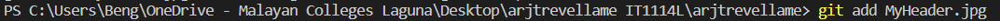
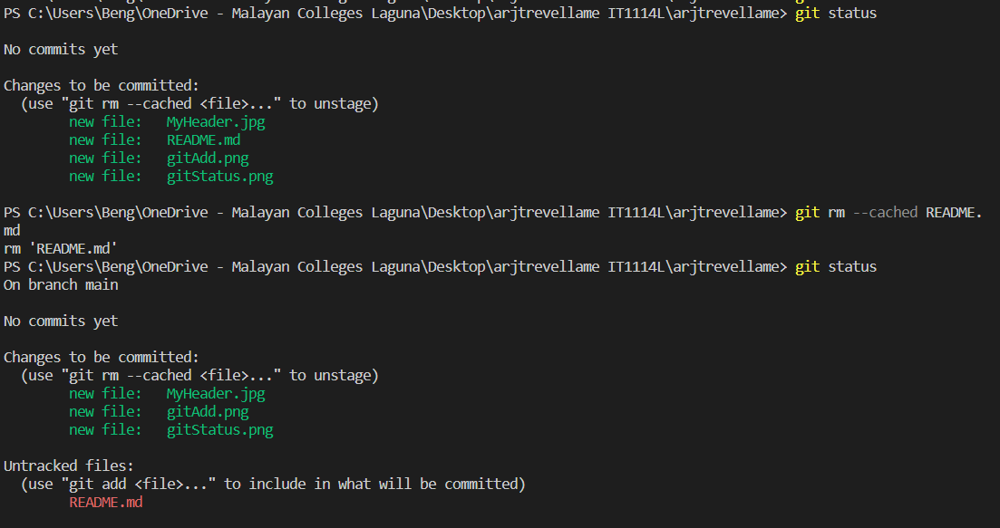
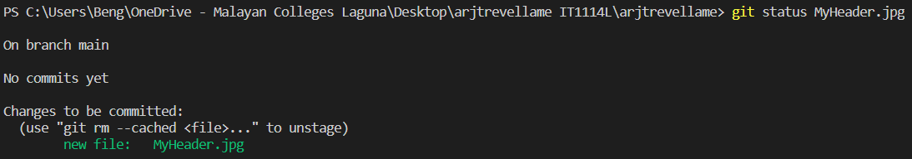
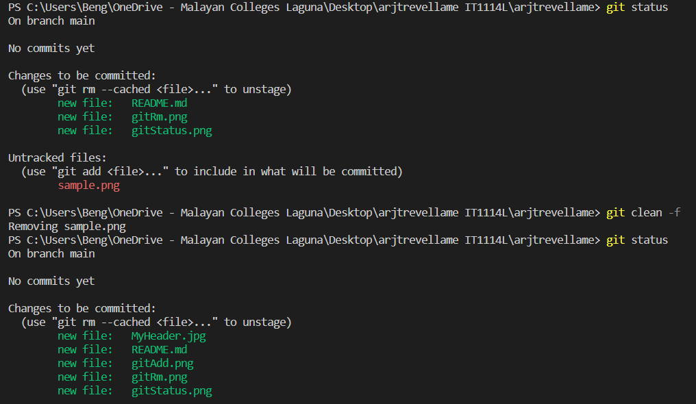

# About Me
+ Hi, gals and guys. I am **Avon Reeven Jane T. Revellame**, but it would be great if you would call me "**Rane**."
+ **Computer Science** student at *Mapua Malayan Colleges Laguna*
+ My interests include *listening to music, reading books, and doing some artsy stuff.*  

# Git Command Cheat Sheets

**1. Git Add** 

*Description*: Moves changes from the working directory to the staging area. This allows you to prepare a snapshot before committing it to the official history. 

*Parameter*: **git add <file_directory/file_name>** 

*Example*:  

**2. Git Rm** 
*Description*: Its purpose is to remove files from the Git repository. It has the ability to delete files from both the staging area and the working directory. 

*Parameter*: **git rm <file_name/file_directory>** 

*Example*: 
 

**3. Git Status** 
*Description*: Displays the working directory and staging area status, indicating which files have been updated, staged, or are untracked. 

*Parameter*: **git status <file_directory/file_name>** 

*Example*:  
 

**4. Git Clean** 
*Description*: It is used to remove untracked files from a Git repository's working directory. It aids in repository cleanup by deleting files that are no longer tracked by Git. 

*Parameter*: **git clean -f**

*Example*:  
 

**5. Git Stash** 
*Description*: It is used to save modifications that are not yet ready to be committed. It allows users to save their changes in a "stash" and restore your working directory to its original condition.
 

*Parameter*: **git stash** 
*Example:*  
